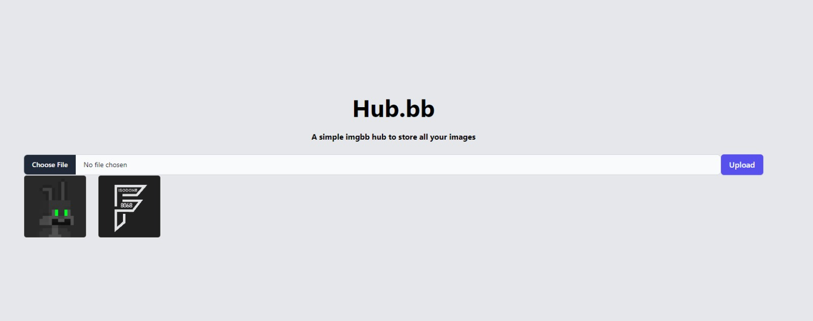

<h1 align="center">Welcome to Hub.bb 🖼️</h1>

## Overview
Hub.bb is an image hosting service that uploads images to ImgBB's reliable image hosting infrastructure. The user can upload images through a sleek and user-friendly interface developed using HTML and Tailwind CSS. The backend service is built on Node.js and Express.js which interact with ImgBB API to upload the images. Uploaded image urls are stored and can be viewed at any time in a nice gallery view. The user also has the ability to delete and copy the url of the uploaded images.

<p align="center">
  
</p>

## Tech Stack
* HTML/CSS/JavaScript (Frontend)
* Node.js and Express.js (Backend)
* Tailwind CSS (Styling)
* ImgBB (Image Hosting)

## Features
* Upload single or multiple images.
* View the uploaded images in a neat layout.
* Delete the uploaded images.
* Copy the url of the images.

## Prerequisites
Before you begin, ensure you have met the following requirements:
* Node.js installed
* Text editor such as Visual Studio Code

## Installation & Usage
To use Hub.bb, follow these steps:
1. Clone this repo:
```bash
git clone https://github.com/joabutt/hub.bb.git 
```
2. Navigate to the project folder:
```bash
cd hub.bb
```
3. Install required dependencies:
```bash
npm install
```
4. Add your [ImgBB Api Key](https://api.imgbb.com/) to the .env file:
```env
IMGBB_API_KEY=...
```
5. Start the express server:
```bash
node index.js
```

### Thats it! 🎉🥳👏

## Contributing

1.  Fork it!
2.  Create your feature branch: `git checkout -b my-new-feature`
3.  Add your changes: `git add .`
4.  Commit your changes: `git commit -am 'Add some feature'`
5.  Push to the branch: `git push origin my-new-feature`
6.  Submit a pull request 😎

## Show your support

Give a ⭐️ if this project helped you!